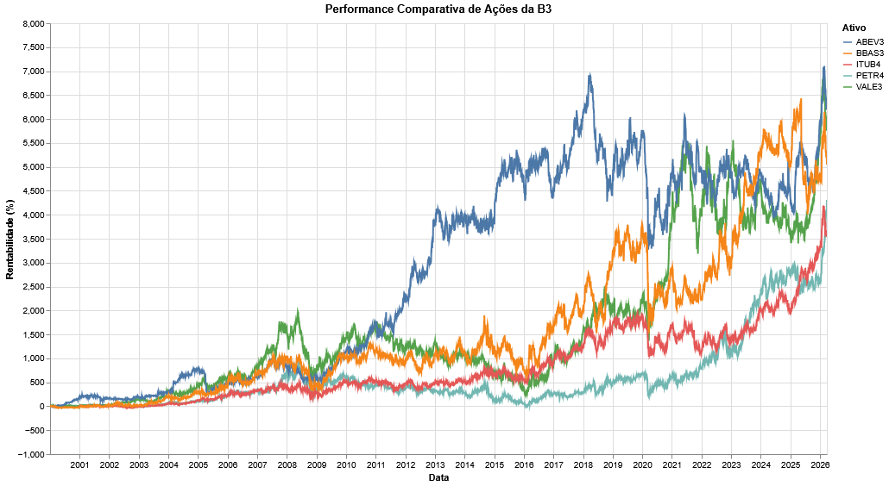

# Relatório

> [!CAUTION]
>
> - Você <ins>**não pode utilizar ferramentas de IA para escrever este relatório**</ins>.

## Identificação

- **Nome**: Felipe Pasinato Rossoni
- **Cartão UFRGS:** 587631

## Dados utilizados

> [!IMPORTANT]
>
> - Os dados utilizados devem ser informados como **links** para as fontes originais.
> - Se houver mais de um conjunto de dados, liste todos separadamente.
> - Para cada conjunto de dados, inclua também uma **descrição curta** explicando os dados.

1. **Dataset 1**: https://www3.bcb.gov.br/sgspub/localizarseries/localizarSeries.do?method=prepararTelaLocalizarSeries
    * **Descrição curta**: Índice do CDI obtido da página do Sistema Gerenciador de Séries Temporais do Banco Central do Brasil
2. **Dataset 2**: https://finance.yahoo.com/
    * **Descrição curta**: Ações e outros índices foram obtidos da página do Yahoo Finance. Entre esses estão: ABEV3, BBAS3, IBOV, ITUB4, PETR4, SP500, USDBRL, VALE3.

## Código-fonte da visualização

> [!IMPORTANT]
>
> - Indique abaixo onde está, dentro deste repositório, o código-fonte usado para gerar a visualização.

- **Arquivo principal**: visualizacao_dados_mercado_financeiro.ipynb
- **Arquivos complementares (se houver)**: arquivos_csv, graficos_visualizacao_dados.pdf 

## Imagem da visualização gerada

> [!IMPORTANT]
>
> - Insira aqui uma imagem da visualização criada por você. Troque `imagem-da-visualizacao.png` pelo caminho correto do arquivo no repositório. 
> - Se você criou alguma visualização interativa, então descreva aqui como acessá-la. Por exemplo, se for uma página HTML, coloque o link, ou se for uma visualização 3D, descreva como compilar e executar o código. 

## Descrição da visualização

### Legenda (*caption*)

> [!IMPORTANT]
>
> - Escreva um texto curto explicando como interpretar a visualização. Descreva os elementos visuais, eixos, cores, símbolos ou interações relevantes.
> - Este texto seria a legenda (*caption*) que acompanharia a figura em uma publicação, por exemplo.

A figura apresenta um gráfico de linhas que ilustra a evolução histórica da rentabilidade de cinco grandes ações do índice Ibovespa. O eixo horizontal descreve a linha do tempo, cobrindo o período de 2000 até março de 2026, enquanto o eixo vertical indica a rentabilidade acumulada em porcentagem (%), calculada com base no reinvestimento dos dividendos. Cada linha colorida traça o desempenho de um ativo específico, identificado pela legenda no canto superior direito: ABEV3 em azul, BBAS3 em laranja, ITUB4 em vermelho, PETR4 em azul claro e VALE3 em verde.

Para interpretar a visualização, basta acompanhar a trajetória das linhas ao longo dos anos. A altura de cada curva em um determinado momento reflete o retorno acumulado daquela ação até aquela data, permitindo uma comparação visual e direta sobre qual empresa apresentou maior crescimento e sua volatilidade no período analisado em relação às demais.

### Conclusão demonstrada pela visualização

> [!IMPORTANT]
>
> - Escreva uma conclusão curta sobre os dados com base na visualização.
> - Explique qual insight, padrão ou tendência pode ser observado.

Foram analisados diferentes ativos do mercado financeiro nesta visualização, incluindo índices, moedas e ações, com a finalidade de comparar rentabilidade, risco, volume e comportamento em diversos momentos de mercado. Os gráficos mostraram que o desempenho dos ativos varia bastante ao longo do tempo e que o cenário macroeconômico influencia fortemente tanto a bolsa brasileira quanto o câmbio. Também foi possível observar diferenças entre setores e entre ativos mais estáveis e mais voláteis, reforçando a importância de analisar risco e retorno em conjunto.
